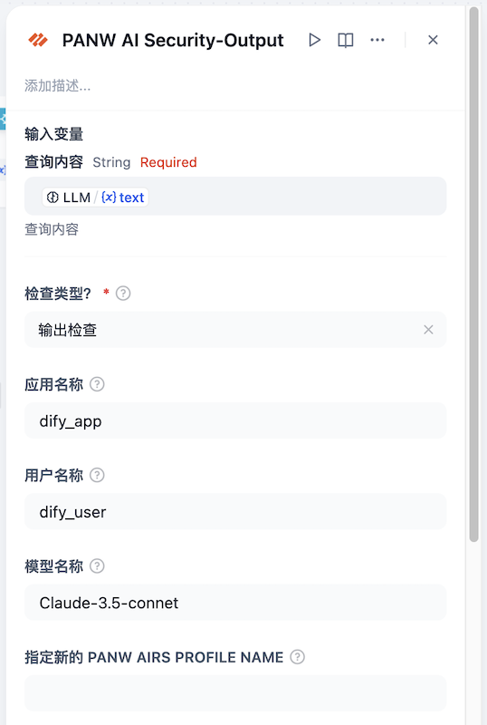

## PANW AI Security Tools for Dify

**作者：** Matt Zhang

**版本：** 0.0.2

**类型：** tool

### 概述

该插件是一款适用于 Dify 平台的 PANW AI Runtime Security API 安全工具，旨在增强 AI 模型和数据交互中的安全性，通过集成 Palo Alto Networks 先进的云威胁检测服务，为用户提供全方位的安全防护。

### 前提条件

已获得授权的用户，请参照[此文档](https://docs.paloaltonetworks.com/ai-runtime-security/activation-and-onboarding/ai-runtime-security-api-intercept-overview)完成 AI Runtime Security 的配置。

如还未获得授权，请[联系 Palo Alto Networks 客户经理](https://www.paloaltonetworks.cn/contact)。

### 主要功能

- **提示词检测**：扫描 Dify 应用的用户输入，防止提示词注入、大模型 DoS 攻击、不安全的 URL 等安全问题，确保 AI 模型的安全运行。
- **模型与数据保护**：扫描大模型的输出，防止大模型意外泄露 PII 等敏感数据；防止大模型返回恶意 URL、恶意内容等安全风险。
- **灵活集成**：无缝集成到 Dify 的现有架构中，无需对模型进行定制化修改，支持工作流、Agent 等多种对接方式。

### 基本使用示例

#### 安装及授权

通过 **Marketplace/Github/本地插件**等方式安装插件，安装完毕后点击“去授权”，确保认证成功。

#### 在 Chatflow 中调用

可以在 Chatflow 中分别调用插件对输入和输出内容进行检索，同时需要搭配“条件分支”来进行判断，如果检测结果中包含 "allow" 则继续进行工作流，否则返回静态内容，停止工作流。

输入侧工具调用示例如下：

具体参数说明如下：

- 进行输入检查还是输出检查？：PANW AIRS Prompt/Response 标识符，用于区分待检测内容属于输入还是输出
- 应用名称（可选）：该 Chatflow/Agent 的名称，用于日志记录
- 用户名称（可选）：当前应用的用户标识，用于日志记录
- 模型名称（可选）：当前应用所使用的模型名称，用于日志记录
- 指定新的 PANW AIRS Profile Name（可选）：如果想针对该应用使用不同的 Profile，可以通过此参数来调整。默认将会使用全局配置的 Profile Name

输入判断组件配置如下：

输出侧工具调用示例如下：

输出判断组件配置如下：

#### 在 Agent 中调用

提示词示例：

> 你是一个个人信息查询对话机器人。
>
> 你需要和用户聊天，在聊天前需要先调用 palo_alto_networks_ai_security_api 对用户的输入进行检查，如果检测结果中包含 block，则回复用户“输入已被禁止”，否则请正常回答问题。
>
>  
>
> 如果用户在询问 Matt 相关的信息，需要查询知识库获取相关的内容。
>
>  
>
> 在回答问题前，需要先将你想回答的内容调用 palo_alto_networks_ai_security_api 对输出进行检查，如果检测结果中包含 block，则回复用户“输出已被禁止”，否则请正常回答问题。

### 功能演示

